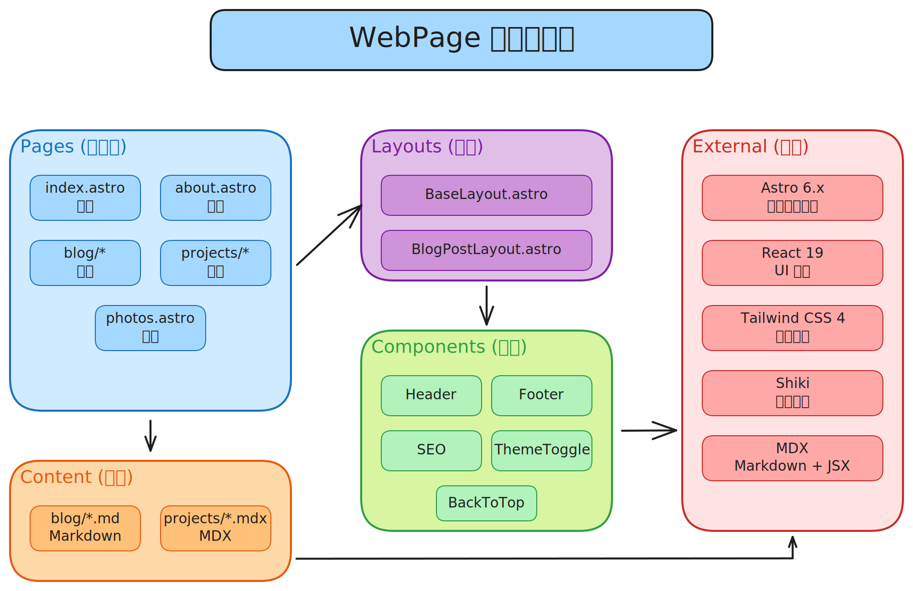

# Vincent Hu - 个人作品集

一个现代化、高性能的个人网站与技术博客，基于 **Astro**、**React**、**Tailwind CSS** 和 **MDX** 构建。专为追求快速加载、SEO 友好且支持多环境部署的开发者设计。

## 🚀 在线预览

| 环境 | 地址 |
|------|------|
| **生产环境** | [vincentbuilds.fun](https://vincentbuilds.fun) |
| **GitHub Pages** | [8bitcloudbot.github.io/portfolio](https://8bitcloudbot.github.io/portfolio) |

## ✨ 功能特性

### 核心功能

- **📝 博客系统** - 支持 Markdown/MDX，具备语法高亮、标签分类和全文搜索
- **💼 项目展示** - 详细的项目页面，支持 MDX 富文本内容
- **📸 照片画廊** - 响应式图片画廊，支持懒加载
- **🌙 暗黑模式** - 主题切换，支持系统偏好检测和本地存储持久化
- **🔍 SEO 优化** - 自动生成站点地图、meta 标签、Open Graph 和结构化数据
- **📱 响应式设计** - 移动优先，基于 Tailwind CSS 断点系统
- **⚡ 高性能** - Astro 静态站点生成（SSG），亚秒级加载速度

### 技术特性

- **内容集合** - 基于 Zod 模式验证的类型安全内容管理
- **组件岛屿** - React 组件按需水合（部分水合策略）
- **图片优化** - Astro 内置自动图片优化
- **RSS 订阅** - 自动生成博客 RSS 订阅源
- **无障碍访问** - 符合 WCAG 2.1 标准，使用语义化 HTML 和 ARIA 标签

## 🛠️ 技术栈

### 核心技术

| 类别 | 技术 | 用途 |
|------|------|------|
| 框架 | [Astro 6.x](https://astro.build) | 岛屿架构静态站点生成器 |
| UI 组件 | [React 19](https://react.dev) | 交互式客户端组件 |
| 样式 | [Tailwind CSS 4.x](https://tailwindcss.com) | 工具类优先的 CSS 框架 |
| 内容 | [MDX](https://mdxjs.com/) | 支持 JSX 的 Markdown 扩展 |
| 类型安全 | [TypeScript](https://www.typescriptlang.org/) | 静态类型检查 |

### 集成工具

| 工具 | 用途 |
|------|------|
| [@astrojs/sitemap](https://docs.astro.build/en/guides/integrations-guide/sitemap/) | 自动生成站点地图 |
| [@astrojs/mdx](https://docs.astro.build/en/guides/integrations-guide/mdx/) | MDX 内容支持 |
| [@astrojs/react](https://docs.astro.build/en/guides/integrations-guide/react/) | React 组件集成 |
| [GitHub Actions](https://github.com/features/actions) | CI/CD 自动化 |

### 部署基础设施

| 组件 | 技术 |
|------|------|
| 主服务器 | 阿里云 ECS + Nginx |
| 备用托管 | GitHub Pages |
| CI/CD | GitHub Actions |
| SSL 证书 | Let's Encrypt |

## 🏗️ 系统架构



## 📦 安装

### 环境要求

- **Node.js** >= 22.12.0（推荐使用 [nvm](https://github.com/nvm-sh/nvm) 或 [fnm](https://github.com/Schniz/fnm) 管理版本）
- **npm** >= 10.x 或 **pnpm** >= 9.x
- **Git** 版本控制

### 快速开始

```bash
# 克隆仓库
git clone https://github.com/8BitcloudBot/portfolio.git
cd portfolio

# 安装依赖
npm install

# 启动开发服务器
npm run dev
```

访问 `http://localhost:4321` 查看网站。

### 使用 pnpm

```bash
# 安装 pnpm（如未安装）
npm install -g pnpm

# 安装依赖
pnpm install

# 启动开发服务器
pnpm dev
```

## 📁 项目结构

```
portfolio/
├── .github/
│   └── workflows/
│       └── deploy.yml          # CI/CD 多环境部署工作流
├── public/
│   ├── photos/                 # 照片画廊图片
│   └── favicon.svg             # 网站图标
├── src/
│   ├── components/
│   │   ├── blog/               # 博客列表和文章组件
│   │   ├── icons/              # SVG 图标组件（内联 SVG）
│   │   ├── layout/             # 页头、页脚、返回顶部、导航
│   │   ├── projects/           # 项目卡片和列表组件
│   │   └── ui/                 # 共享 UI 组件（SEO、主题切换）
│   ├── content/
│   │   ├── blog/               # 博客文章（Markdown + frontmatter）
│   │   └── projects/           # 项目页面（MDX + frontmatter）
│   ├── layouts/
│   │   └── BaseLayout.astro    # 主布局包装器
│   ├── pages/
│   │   ├── index.astro         # 首页
│   │   ├── about.astro         # 关于页面
│   │   ├── blog/
│   │   │   ├── index.astro     # 博客列表页
│   │   │   └── [slug].astro    # 动态博客文章页
│   │   ├── projects/
│   │   │   ├── index.astro     # 项目列表页
│   │   │   └── [slug].astro    # 动态项目详情页
│   │   └── photos.astro        # 照片画廊页
│   ├── styles/
│   │   └── global.css          # 全局样式和 Tailwind 导入
│   └── config.ts               # 站点配置（标题、导航、社交链接）
├── astro.config.ts             # Astro 配置（集成、环境变量）
├── deploy.sh                   # 多环境部署脚本
├── tsconfig.json               # TypeScript 配置
└── package.json                # 依赖和脚本
```

### 关键文件

| 文件 | 用途 |
|------|------|
| `src/config.ts` | 站点元数据、导航和社交链接配置 |
| `astro.config.ts` | 多环境配置（生产/GitHub/开发） |
| `deploy.sh` | 本地部署脚本，支持环境切换 |
| `.github/workflows/deploy.yml` | GitHub Actions CI/CD 流水线 |

## 🗺️ 页面路由

| 路由 | 页面 | 说明 |
|------|------|------|
| `/` | 首页 | 包含精选内容的落地页 |
| `/about` | 关于 | 个人介绍和技能 |
| `/blog` | 博客列表 | 所有博客文章，支持分页 |
| `/blog/[slug]` | 博客文章 | 单篇文章（Markdown/MDX） |
| `/projects` | 项目列表 | 作品集项目概览 |
| `/projects/[slug]` | 项目详情 | 单个项目页面（MDX） |
| `/photos` | 照片画廊 | 图片画廊，支持灯箱效果 |

## 📝 内容管理

### 添加博客文章

在 `src/content/blog/` 目录创建新的 `.md` 文件：

```markdown
---
title: "文章标题"
pubDate: 2026-01-01
description: "文章简介，用于 SEO 和预览"
tags: ["标签1", "标签2", "标签3"]
lang: "zh"  # 或 "en"
---

文章内容...
```

### 添加项目

在 `src/content/projects/` 目录创建新的 `.mdx` 文件：

```mdx
---
title: "项目名称"
description: "项目描述"
pubDate: 2026-01-01
tags: ["React", "TypeScript"]
github: "https://github.com/username/repo"
live: "https://example.com"
---

项目详情，支持 MDX 富文本...
```

### 内容 Frontmatter 字段说明

#### 博客文章

| 字段 | 类型 | 必填 | 说明 |
|------|------|------|------|
| `title` | string | 是 | 文章标题 |
| `pubDate` | date | 是 | 发布日期（YYYY-MM-DD） |
| `description` | string | 是 | SEO 描述 |
| `tags` | string[] | 是 | 分类标签 |
| `lang` | string | 否 | 语言代码（zh/en） |

#### 项目

| 字段 | 类型 | 必填 | 说明 |
|------|------|------|------|
| `title` | string | 是 | 项目名称 |
| `description` | string | 是 | 项目简介 |
| `pubDate` | date | 是 | 发布日期 |
| `tags` | string[] | 是 | 技术标签 |
| `github` | string | 否 | GitHub 仓库地址 |
| `live` | string | 否 | 在线演示地址 |

## ⚡ 命令

### 开发

| 命令 | 说明 |
|------|------|
| `npm run dev` | 启动本地开发服务器（localhost:4321），支持热更新 |
| `npm run build` | 构建生产版本（默认环境） |
| `npm run preview` | 本地预览生产构建 |

### 环境构建

| 命令 | 环境 | 输出 |
|------|------|------|
| `npm run build:production` | 阿里云 | `dist/`，根路径 |
| `npm run build:github` | GitHub Pages | `dist/`，`/portfolio` 路径 |
| `npm run build:development` | 本地 | `dist/`，localhost 路径 |

### 部署

| 命令 | 说明 |
|------|------|
| `npm run deploy:production` | 构建并通过 SSH 部署到阿里云 |
| `npm run deploy:github` | 构建并触发 GitHub Pages 部署 |
| `npm run deploy:all` | 依次部署到所有环境 |

### 工具

| 命令 | 说明 |
|------|------|
| `npm run astro` | 运行 Astro CLI 命令 |
| `npm run astro -- --help` | 显示 Astro CLI 帮助 |

## 🚀 部署

本项目支持**三环境部署**，包含自动和手动触发方式：

| 环境 | 地址 | 触发方式 | 服务器 |
|------|------|----------|--------|
| **本地** | `http://localhost:4321` | `npm run dev` | 本地机器 |
| **GitHub Pages** | [8bitcloudbot.github.io/portfolio](https://8bitcloudbot.github.io/portfolio) | 推送到 `main` 分支 | GitHub Actions |
| **阿里云** | [vincentbuilds.fun](https://vincentbuilds.fun) | 手动触发 | 阿里云 ECS + Nginx |

### 部署方式

#### 1. 本地部署（推荐用于测试）

```bash
# 启动开发服务器（热更新）
npm run dev

# 构建并预览生产版本
npm run build:production
npm run preview
```

#### 2. GitHub Pages（自动）

推送到 `main` 分支将自动触发 GitHub Actions 部署：

```bash
git add .
git commit -m "feat: 你的更改"
git push origin main
# GitHub Actions 自动构建并部署
```

#### 3. 阿里云（手动）

```bash
# 部署到生产服务器
npm run deploy:production

# 或直接使用 deploy.sh
./deploy.sh production
```

#### 4. 部署到所有环境

```bash
npm run deploy:all
# 构建并依次部署到 GitHub Pages 和阿里云
```

### GitHub Actions 工作流

CI/CD 流水线支持：

- **自动部署**：推送到 `main` 分支时自动部署到 GitHub Pages
- **手动部署**：可选择部署环境：
  - `github` - 仅部署到 GitHub Pages
  - `production` - 仅部署到阿里云
  - `all` - 同时部署到两个环境

触发手动部署：
1. 进入仓库的 **Actions** 标签页
2. 选择 **"Deploy to Multiple Environments"** 工作流
3. 点击 **"Run workflow"**
4. 选择环境后点击 **"Run workflow"**

### 环境变量

本地部署需创建 `.deploy.env` 文件（已加入 .gitignore）：

```bash
# 阿里云配置
ALIYUN_SERVER_HOST=服务器IP
ALIYUN_SERVER_USER=root
ALIYUN_DEPLOY_PATH=/var/www/vincentbuilds
```

GitHub Actions 需在仓库设置中配置以下 Secrets：
- `ALIYUN_SSH_KEY` - 阿里云服务器 SSH 私钥
- `ALIYUN_SERVER_HOST` - 服务器 IP 地址
- `ALIYUN_SERVER_USER` - 服务器用户名
- `ALIYUN_DEPLOY_PATH` - 服务器部署路径

详细部署说明请参阅 [DEPLOYMENT_GUIDE.md](./DEPLOYMENT_GUIDE.md)。
站点运维指南请参阅 [OPERATIONS_GUIDE.md](./OPERATIONS_GUIDE.md)。

## 🔧 配置

### 站点配置

编辑 `src/config.ts` 自定义站点元数据：

```typescript
export const SITE = {
  title: "你的名字",
  description: "站点描述",
  author: "你的名字",
  email: "your.email@example.com",
  github: "https://github.com/yourusername",
  nav: [
    { name: "博客", path: "/blog", icon: "article" },
    { name: "项目", path: "/projects", icon: "lightbulb" },
    // 添加更多导航项...
  ],
  social: [
    { name: "GitHub", url: "https://github.com/yourusername", icon: "github" },
    // 添加更多社交链接...
  ],
};
```

### 多环境配置

`astro.config.ts` 支持环境相关配置：

```typescript
const environments = {
  production: {
    site: 'https://vincentbuilds.fun',
    base: '/',
  },
  github: {
    site: 'https://8bitcloudbot.github.io',
    base: '/portfolio',
  },
  development: {
    site: 'http://localhost:4321',
    base: '/',
  },
};
```

## 🧪 测试

### 本地测试清单

- [ ] 运行 `npm run dev` 并测试所有页面
- [ ] 测试暗黑模式切换
- [ ] 验证移动端响应式设计
- [ ] 检查博客文章渲染
- [ ] 测试导航链接
- [ ] 验证图片加载

### 构建测试

```bash
# 测试生产构建
npm run build:production
npm run preview

# 测试 GitHub Pages 构建
npm run build:github
npm run preview
```

### 性能测试

使用 [Lighthouse](https://developers.google.com/web/tools/lighthouse) 验证：
- 性能评分 > 90
- 无障碍评分 > 90
- SEO 评分 > 90

## 📚 文档

| 文档 | 说明 |
|------|------|
| [README.md](./README.md) | 本文档 - 项目概览和使用说明 |
| [DEPLOYMENT_GUIDE.md](./DEPLOYMENT_GUIDE.md) | 详细部署指南 |
| [OPERATIONS_GUIDE.md](./OPERATIONS_GUIDE.md) | 站点运维指南 |

## 🤝 贡献

欢迎贡献！请遵循以下步骤：

1. **Fork** 本仓库
2. **创建** 功能分支（`git checkout -b feature/amazing-feature`）
3. **提交** 更改（`git commit -m 'feat: add amazing feature'`）
4. **推送** 到分支（`git push origin feature/amazing-feature`）
5. **发起** Pull Request

### 开发规范

- 遵循现有代码风格和规范
- 为新组件添加 TypeScript 类型
- 提交前在本地测试更改
- 使用 [Conventional Commits](https://www.conventionalcommits.org/) 规范编写提交信息

## 🐛 问题排查

### 常见问题

| 问题 | 解决方案 |
|------|----------|
| 构建失败，Node.js 报错 | 确保 Node.js >= 22.12.0（`node -v`） |
| 图片无法加载 | 检查 `public/` 目录和文件路径 |
| GitHub Pages 404 | 验证 `astro.config.ts` 中的 `base` 路径 |
| 部署失败 | 检查 SSH 密钥和服务器配置 |

### 获取帮助

- 查看 [GitHub Issues](https://github.com/8BitcloudBot/portfolio/issues) 了解已知问题
- 参阅 [Astro 文档](https://docs.astro.build) 解决框架相关问题
- 提交新 Issue 并附上详细错误信息

## 📄 许可证

本项目基于 **MIT 许可证** - 详见 [LICENSE](LICENSE) 文件。

你可以自由使用本项目作为个人作品集模板。欢迎注明出处，但非必须。

## 🙏 致谢

- [Astro](https://astro.build) - 内容驱动的 Web 框架
- [Tailwind CSS](https://tailwindcss.com) - 工具类优先的 CSS 框架
- [React](https://react.dev) - 构建用户界面的 JavaScript 库
- [Heroicons](https://heroicons.com) - 精美的手工 SVG 图标

## 📧 联系方式

- **邮箱**: 17889786156@163.com
- **GitHub**: [@8BitcloudBot](https://github.com/8BitcloudBot)
- **网站**: [vincentbuilds.fun](https://vincentbuilds.fun)

---

**使用 Astro、React 和 Tailwind CSS 精心打造 ❤️**
