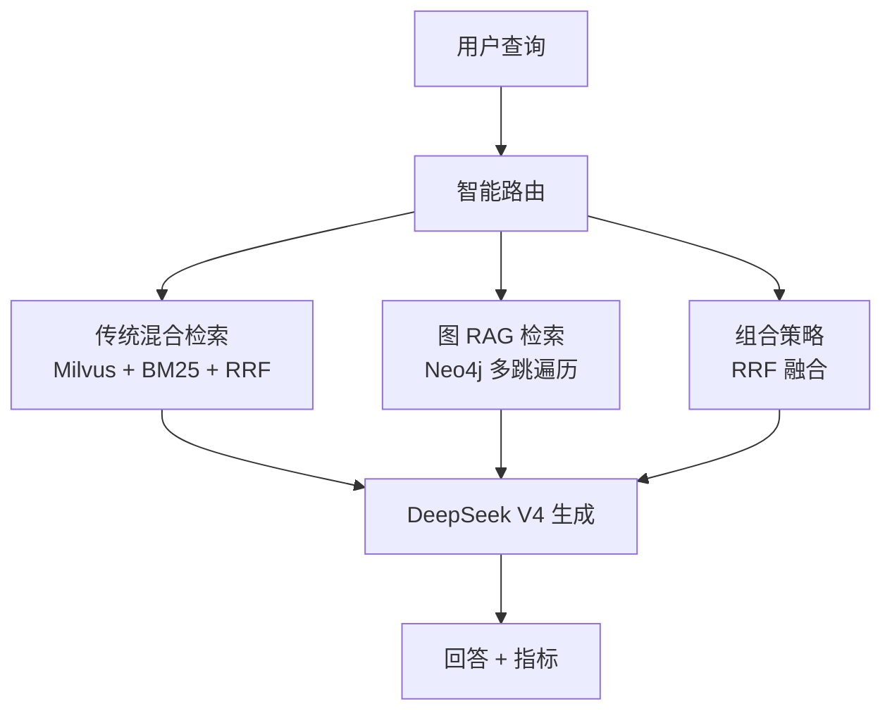
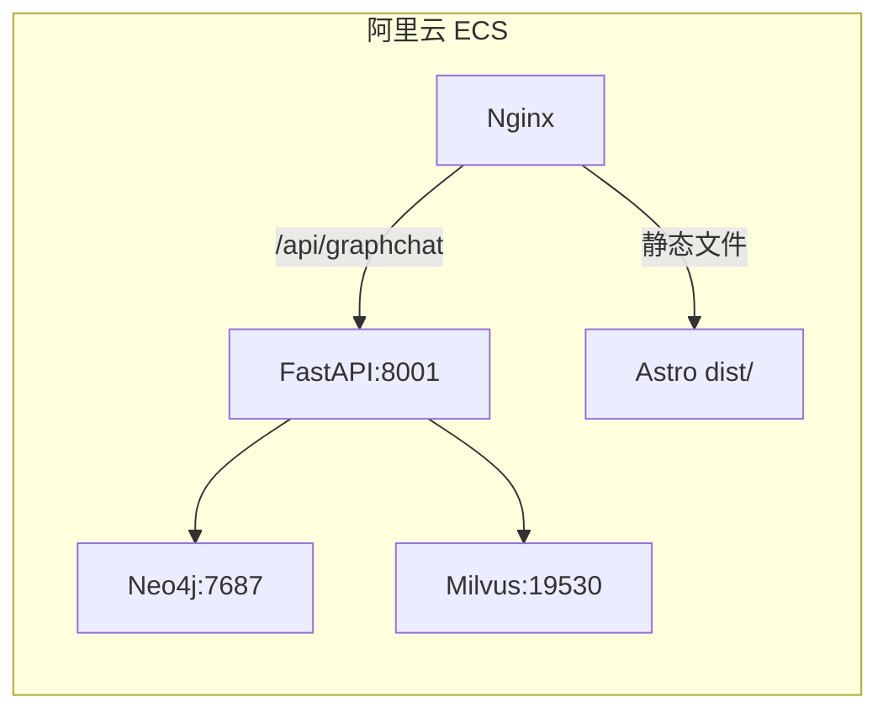

# ChefMate GraphRAG 生产部署计划

> 将 ChefMate GraphRAG 部署到阿里云服务器 `vincentbuilds.fun`，更新 GitHub 仓库、前端 UI、项目文档。

---

## Phase 1：本地代码更新（GitHub 仓库）

### 1.1 GraphRAG 标签改为「在线可用」

**文件：** `src/pages/chefmate.astro:42`

```
- <span class="ml-auto rounded-full bg-violet-500/20 px-2 py-0.5 text-[10px] font-mono text-violet-700 dark:text-violet-300">开发中</span>
+ <span class="ml-auto rounded-full bg-emerald-500/20 px-2 py-0.5 text-[10px] font-mono text-emerald-700 dark:text-emerald-300">在线可用</span>
```

### 1.2 GraphRAG API URL 改为相对路径

**文件：** `src/pages/chefmate.astro:617`

```
- const GRAPHRAG_API = 'http://localhost:8001/api/graphchat';
+ const GRAPHRAG_API = '/api/graphchat';
```

生产环境通过 Nginx 代理 `/api/graphchat` → `http://127.0.0.1:8001`，无需硬编码端口。

### 1.3 更新 chefmate-graphrag.mdx 状态

**文件：** `src/content/projects/chefmate-graphrag.mdx:20`

```
- | 状态 | ✅ 生产运行 | 🚧 后端开发中 |
+ | 状态 | ✅ 生产运行 | ✅ 生产运行 |
```

### 1.4 重构 chefmate-graphrag.mdx 为完整项目文章

**文件：** `src/content/projects/chefmate-graphrag.mdx`

扩展为完整的项目介绍文章，包含：

```markdown
---
title: "ChefMate GraphRAG — 图增强智能食谱问答"
description: "基于 Neo4j + Milvus + DeepSeek V4 的知识图谱 RAG 系统，支持多跳推理、智能路由与三级降级策略。"
pubDate: 2026-05-19
tags: ["GraphRAG", "Neo4j", "Milvus", "DeepSeek", "RAG"]
github: "https://github.com/8BitcloudBot/ChefMate-GraphRAG"
demo: "/chefmate/#graphrag"
---

> ChefMate 的下一代版本，引入 Neo4j 知识图谱解决传统 RAG 在复杂推理上的局限。

## 架构



## 三策略路由

| 策略 | 触发条件 | 检索方式 |
|------|---------|---------|
| 🔍 传统混合 | 「宫保鸡丁怎么做」 | Milvus 向量 + BM25 关键词 + RRF |
| 🕸️ 图 RAG | 「鸡肉配什么蔬菜」 | Neo4j 多跳遍历 + 子图提取 |
| 🔄 组合策略 | 「哪些菜用了土豆又用了猪肉」 | 传统 + 图 RAG → RRF 融合 |

## 知识图谱

基于 Neo4j 构建的菜谱知识图谱：

- **360 个 Recipe 节点**：包含菜名、菜系、难度、份量、标签
- **1056 个 Ingredient 节点**：包含食材名、分类
- **3392 个 CookingStep 节点**：烹饪步骤详解
- **6138 个关系**：REQUIRES、BELONGS_TO_CATEGORY、SIMILAR_TO、SUBSTITUTE_FOR

## 多跳推理示例

```
用户: "鸡肉配什么蔬菜"
图遍历: 鸡肉(Ingredient) → 新疆大盘鸡(Recipe) → 大蒜(Ingredient) → 蔬菜(Category)
回答: 鸡肉通过大盘鸡与大蒜建立搭配 → 推理出根茎类+香辛类蔬菜是最佳搭档
```

## 幻觉防御（三重防线）

1. JSON 结构化输出 → 物理约束
2. 有效菜名白名单过滤 → 规则剔除
3. difflib 模糊匹配 → 纠错提示

## 技术栈

| 组件 | 技术 |
|------|------|
| 图数据库 | Neo4j 5.26 Community |
| 向量数据库 | Milvus 2.5 Standalone |
| LLM | DeepSeek V4 API |
| 嵌入模型 | BAAI/bge-small-zh-v1.5 (512-dim) |
| Web 框架 | FastAPI + SSE Streaming |
| 前端 | Astro + Tailwind CSS |

## 部署架构



## 与 V1 对比

| 维度 | RAG 版 (V1) | GraphRAG 版 (V2) |
|------|------------|------------------|
| 检索方式 | FAISS + BM25 | Milvus + BM25 + Neo4j |
| 推理能力 | 文本匹配 | 多跳遍历 + 子图提取 + 图推理 |
| 查询路由 | LLM 3 分类 | 规则引擎 + LLM 多维分析 |
| 食材搭配 | ❌ 不支持 | ✅ 图谱关系推理 |
| 相似菜品 | ❌ 不支持 | ✅ 共享食材 ≥ 3 自动关联 |
| 食材替代 | ❌ 不支持 | ✅ SUBSTITUTE_FOR 关系 |
| 部署复杂度 | 1 容器 | 4 容器（Neo4j+Milvus+etcd+minio+API） |
| 状态 | ✅ 生产运行 | ✅ 生产运行 |
```

### 1.5 更新 chefmate.mdx 添加 V2 链接

**文件：** `src/content/projects/chefmate.mdx`

在文章末尾添加：
```markdown
## V2 演进

ChefMate GraphRAG 版本已上线，支持基于知识图谱的多跳推理和智能路由。  
[查看 ChefMate GraphRAG →](/projects/chefmate-graphrag)
```

### 1.6 清理 .env 中的明文密钥

**文件：** `chefmate-graphrag/.env`

```
- DEEPSEEK_API_KEY="sk-5ede8a242362474bbd7911e0bc5b698f"
+ DEEPSEEK_API_KEY=sk-your-deepseek-api-key
```

### 1.7 commit + push

```bash
cd /Users/wxhu/Documents/OpenCode/AllInWeb
git add -A
git commit -m "feat: GraphRAG production deployment — online badge, relative API, docs"
git push origin main
```

---

## Phase 2：服务器 GraphRAG 容器部署

### 2.1 创建服务器部署目录

```bash
ssh -i ~/.ssh/aliyun_ecs root@vincentbuilds.fun
mkdir -p /var/www/chefmate-graphrag/{runtime,data}
```

### 2.2 合并 docker-compose.yml

在服务器 `/var/www/vincentbuilds-api/docker-compose.yml` 中追加以下服务：

```yaml
  # ========== ChefMate GraphRAG 依赖 ==========
  neo4j:
    image: neo4j:5.26-community
    ports:
      - "127.0.0.1:7474:7474"
      - "127.0.0.1:7687:7687"
    environment:
      NEO4J_AUTH: neo4j/${NEO4J_PASSWORD}
      NEO4J_server_memory_heap_initial__size: 512m
      NEO4J_server_memory_heap_max__size: 1G
    volumes:
      - neo4j_data:/data
      - neo4j_logs:/logs
    mem_limit: 2g

  etcd:
    image: quay.io/coreos/etcd:v3.5.5
    environment:
      ETCD_AUTO_COMPACTION_MODE: revision
      ETCD_AUTO_COMPACTION_RETENTION: "1000"
      ETCD_QUOTA_BACKEND_BYTES: "4294967296"
    volumes:
      - etcd_data:/etcd
    command: etcd -advertise-client-urls=http://127.0.0.1:2379 -listen-client-urls http://0.0.0.0:2379 --data-dir /etcd
    mem_limit: 512m

  minio:
    image: minio/minio:RELEASE.2023-03-20T20-16-18Z
    environment:
      MINIO_ACCESS_KEY: minioadmin
      MINIO_SECRET_KEY: minioadmin
    volumes:
      - minio_data:/minio_data
    command: minio server /minio_data --console-address ":9001"
    mem_limit: 1g

  milvus:
    image: milvusdb/milvus:v2.5.4
    command: ["milvus", "run", "standalone"]
    ports:
      - "127.0.0.1:19530:19530"
      - "127.0.0.1:9091:9091"
    environment:
      ETCD_ENDPOINTS: etcd:2379
      MINIO_ADDRESS: minio:9000
      MINIO_ACCESS_KEY_ID: minioadmin
      MINIO_SECRET_ACCESS_KEY: minioadmin
    volumes:
      - milvus_data:/var/lib/milvus
    mem_limit: 4g
    depends_on:
      - etcd
      - minio

  graphrag-api:
    build:
      context: ./chefmate-graphrag
      dockerfile: Dockerfile
    ports:
      - "127.0.0.1:8001:8001"
    depends_on:
      - neo4j
      - milvus
    environment:
      NEO4J_URI: bolt://neo4j:7687
      NEO4J_USER: neo4j
      NEO4J_PASSWORD: ${NEO4J_PASSWORD}
      MILVUS_HOST: milvus
      MILVUS_PORT: 19530
      DEEPSEEK_API_KEY: ${DEEPSEEK_API_KEY}
      HF_ENDPOINT: "https://hf-mirror.com"
    volumes:
      - ./chefmate-graphrag/runtime:/app/runtime
    command: ["uvicorn", "server:app", "--host", "0.0.0.0", "--port", "8001"]

volumes:
  neo4j_data:
  neo4j_logs:
  etcd_data:
  minio_data:
  milvus_data:
```

### 2.3 同步 GraphRAG 后端代码到服务器

```bash
rsync -avz -e "ssh -i ~/.ssh/aliyun_ecs" \
  chefmate-graphrag/ \
  root@vincentbuilds.fun:/var/www/chefmate-graphrag/
```

排除 `vector_index/`、`runtime/`、`.venv/`（云端独立生成）。

### 2.4 启动所有容器

```bash
ssh -i ~/.ssh/aliyun_ecs root@vincentbuilds.fun "
  cd /var/www/vincentbuilds-api
  docker compose up -d
"
```

### 2.5 云端构建知识图谱

```bash
ssh -i ~/.ssh/aliyun_ecs root@vincentbuilds.fun "
  cd /var/www/chefmate-graphrag
  echo y | uv run python scripts/build_graph.py
"
```

> 注意：云端独立构建知识图谱 + Milvus 索引，不复制本地 `vector_index/`。

### 2.6 创建服务器 .env

```bash
ssh -i ~/.ssh/aliyun_ecs root@vincentbuilds.fun "
  cat > /var/www/vincentbuilds-api/.env.graphrag << 'EOF'
NEO4J_PASSWORD=<生成强密码>
DEEPSEEK_API_KEY=<生产 API Key>
MILVUS_HOST=milvus
MILVUS_PORT=19530
NEO4J_URI=bolt://neo4j:7687
NEO4J_USER=neo4j
DAILY_QUOTA=200
MONTHLY_QUOTA=3000
EOF
"
```

---

## Phase 3：Nginx 配置

### 3.1 在服务器 Nginx 配置中新增路由

**文件：** `/etc/nginx/sites-available/vincentbuilds`（或当前配置路径）

在 `server` 块中添加：

```nginx
# GraphRAG API
location /api/graphchat {
    proxy_pass http://127.0.0.1:8001/api/graphchat;
    proxy_set_header Host $host;
    proxy_set_header X-Real-IP $remote_addr;
    proxy_set_header X-Forwarded-For $proxy_add_x_forwarded_for;
    proxy_buffering off;
}

location /api/graphchat/stream {
    proxy_pass http://127.0.0.1:8001/api/graphchat/stream;
    proxy_set_header Host $host;
    proxy_set_header X-Real-IP $remote_addr;
    proxy_buffering off;
    proxy_cache off;
    proxy_read_timeout 120s;
}

location /api/graphrag/ {
    proxy_pass http://127.0.0.1:8001/api/graphrag/;
    proxy_set_header Host $host;
    proxy_set_header X-Real-IP $remote_addr;
}
```

### 3.2 重载 Nginx

```bash
ssh -i ~/.ssh/aliyun_ecs root@vincentbuilds.fun "nginx -t && nginx -s reload"
```

---

## Phase 4：CI/CD 更新

### 4.1 更新 `.github/workflows/deploy.yml`

在 `deploy-aliyun` job 中增加 chefmate-graphrag 同步步骤：

```yaml
- name: Deploy Backend (ChefMate-RAG)
  uses: appleboy/ssh-action@v1
  with:
    host: ${{ secrets.ALIYUN_SERVER_HOST }}
    username: ${{ secrets.ALIYUN_SERVER_USER }}
    key: ${{ secrets.ALIYUN_SSH_KEY }}
    script: |
      rsync -avz --exclude 'vector_index/' --exclude 'runtime/' --exclude '.venv/' \
        ${{ github.workspace }}/chefmate/ /var/www/vincentbuilds-api/chefmate/
      cd /var/www/vincentbuilds-api && docker compose up -d --build vincentbuilds

- name: Deploy Backend (ChefMate-GraphRAG)
  uses: appleboy/ssh-action@v1
  with:
    host: ${{ secrets.ALIYUN_SERVER_HOST }}
    username: ${{ secrets.ALIYUN_SERVER_USER }}
    key: ${{ secrets.ALIYUN_SSH_KEY }}
    script: |
      rsync -avz --exclude 'vector_index/' --exclude 'runtime/' --exclude '.venv/' \
        ${{ github.workspace }}/chefmate-graphrag/ /var/www/vincentbuilds-api/chefmate-graphrag/
      cd /var/www/vincentbuilds-api && docker compose up -d --build graphrag-api

- name: Reload Nginx
  uses: appleboy/ssh-action@v1
  with:
    host: ${{ secrets.ALIYUN_SERVER_HOST }}
    username: ${{ secrets.ALIYUN_SERVER_USER }}
    key: ${{ secrets.ALIYUN_SSH_KEY }}
    script: nginx -t && nginx -s reload
```

### 4.2 更新 `sync.sh`

在 `server` 分支中增加 GraphRAG 代码同步和 `build_graph.py` 执行步骤。在部署 V1 端后追加：

```bash
# Deploy GraphRAG backend
echo "[GraphRAG backend]"
rsync -avz --exclude 'vector_index/' --exclude 'runtime/' --exclude '.venv/' \
  chefmate-graphrag/ $ALIYUN_SERVER_USER@$ALIYUN_SERVER_HOST:/var/www/chefmate-graphrag/

ssh $SSH_OPTS "
  cd /var/www/vincentbuilds-api
  docker compose up -d --build graphrag-api
"

echo "[Done] GraphRAG backend deployed."
```

---

## Phase 5：验证检查清单

| # | 验证项 | 方式 |
|---|--------|------|
| 1 | 🕸️ GraphRAG 标签显示「在线可用」 | 打开 https://vincentbuilds.fun/chefmate |
| 2 | 发送查询返回图谱推理答案 | 输入「鸡肉配什么蔬菜」 |
| 3 | METRICS 面板实时更新 | 查看 8 格指标数据 |
| 4 | STRATEGY 高亮命中策略 | 查看高亮卡片 |
| 5 | GRAPH 面板显示节点 | 查看节点点阵 |
| 6 | `/projects/chefmate-graphrag` 文章渲染 | 打开项目文章页 |
| 7 | Nginx `/api/graphchat` 代理生效 | 直接 curl 验证 |
| 8 | 云端 Neo4j 数据独立 | 确认节点数与本地不同（独立构建） |
| 9 | 云端向量索引独立 | 确认 Milvus 索引为云端构建 |
|10 | `/api/graphrag/health` 返回 200 | curl 健康检查 |

---

## 执行顺序

```
Phase 1 (本地代码) → Phase 2 (服务器容器) → Phase 3 (Nginx)
    ↓                       ↓                      ↓
  git push              docker-compose         nginx reload
                        独立建图+索引
                                  ↓
                          Phase 4 (CI/CD)
                                  ↓
                          Phase 5 (验证)
```
