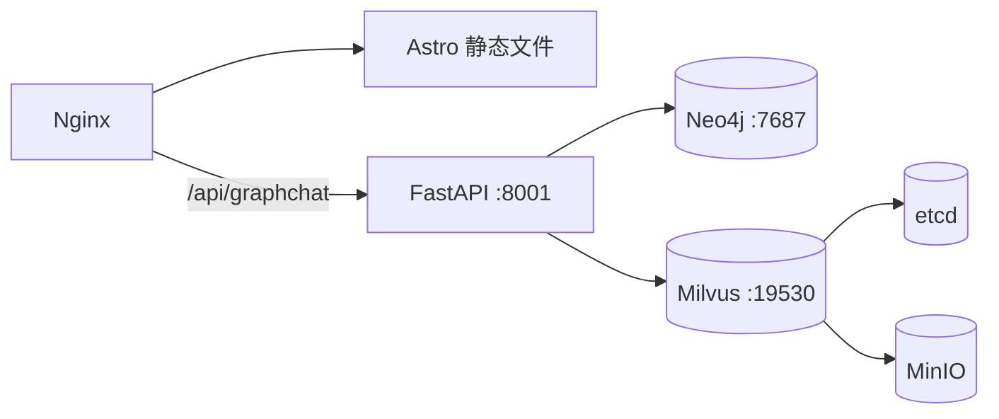

> ChefMate 的下一代版本，引入 Neo4j 知识图谱解决传统 RAG 在复杂推理上的局限。

## 架构

```
用户查询
    │
    ▼
┌─────────────────────────────────┐
│ 智能路由 (Intelligent Router)    │
│ 规则引擎快速路径 + LLM 兜底分析  │
└─────────────────────────────────┘
    │
    ├── hybrid_traditional (60%)  → Milvus + BM25 + RRF
    ├── graph_rag (30%)           → Neo4j 多跳遍历 + 子图提取
    └── combined (10%)            → 传统 + 图 → RRF 融合
         │
         ▼
    DeepSeek V4 生成 + Validator 校验
         │
         ▼
    回答 + 路由策略 + 图指标
```

## 三策略路由

| 策略 | 触发条件 | 检索方式 | 示例查询 |
|------|---------|---------|---------|
| 🔍 传统混合 | 菜谱查询、推荐 | Milvus 向量 + BM25 关键词 + RRF | 「宫保鸡丁怎么做」 |
| 🕸️ 图 RAG | 搭配推理、相似菜品 | Neo4j 多跳遍历 + 子图提取 | 「鸡肉配什么蔬菜」 |
| 🔄 组合策略 | 多条件交叉查询 | 传统 + 图 → RRF 融合 | 「哪些菜用了土豆又用了猪肉」 |

## 知识图谱

从 361 个菜谱 Markdown 文件中自动抽取构建的 Neo4j 知识图谱：

| 统计 | 数量 |
|------|------|
| Recipe 节点 | 360 |
| Ingredient 节点 | 1056 |
| Category 节点 | 16 |
| CookingStep 节点 | 3392 |
| 关系总数 | 6139 |

### Schema

```
节点: Recipe, Ingredient, Category, CookingStep
关系: REQUIRES (食材需求)
      BELONGS_TO_CATEGORY (分类归属)
      SIMILAR_TO (共享食材 ≥ 3 自动关联)
      SUBSTITUTE_FOR (人工规则替代映射)
      CONTAINS_STEP (烹饪步骤)
```

## 多跳推理示例

```
查询: "鸡肉配什么蔬菜"

LLM 图查询规划:
  query_type: multi_hop
  sources: ["鸡肉", "鸡"]
  targets: ["蔬菜"]
  max_depth: 3

Cypher 图遍历:
  (鸡肉:Ingredient)-[:REQUIRES]→
  (新疆大盘鸡:Recipe)-[:REQUIRES]→
  (大蒜:Ingredient)-[:BELONGS_TO_CATEGORY]→
  (蔬菜:Category)

回答: 鸡肉通过大盘鸡与大蒜建立搭配 →
      推理出根茎类+香辛类蔬菜是最佳搭档
```

### 相似菜品推理

```
查询: "和宫保鸡丁类似的菜"
SIMILAR_TO 关系 → 共享食材 ≥ 3 → 自动关联相似菜品
```

### 食材替代查询

```
查询: "土豆能替代什么"
SUBSTITUTE_FOR 关系 → 山药、芋头、红薯
```

## 幻觉防御（三重防线）

1. **JSON 结构化输出** — 约束 LLM 返回 `{"dishes": [{"name": "...", "reason": "..."}]}`
2. **有效菜名白名单过滤** — `valid_names` 物理剔除编造菜名
3. **difflib 模糊匹配** — 近似菜名纠错提示

## 技术栈

| 组件 | 技术 |
|------|------|
| 图数据库 | Neo4j 5.26 Community |
| 向量数据库 | Milvus 2.5 Standalone |
| 嵌入模型 | BAAI/bge-small-zh-v1.5 (512-dim) |
| 关键词检索 | rank-bm25 + jieba |
| LLM | DeepSeek V4 API |
| Web 框架 | FastAPI + SSE Streaming |
| 前端 | Astro + Tailwind CSS + marked.js |
| 部署 | Docker Compose (4 containers) |

## 部署架构



## 与 V1 对比

| 维度 | RAG 版 (V1) | GraphRAG 版 (V2) |
|------|------------|------------------|
| 检索方式 | FAISS + BM25 | Milvus + BM25 + Neo4j |
| 推理能力 | 文本匹配 | 多跳遍历 + 子图提取 + 图推理 |
| 查询路由 | LLM 3 分类 | 规则引擎 + LLM 多维分析 |
| 食材搭配 | ❌ | ✅ 图谱关系推理 |
| 相似菜品 | ❌ | ✅ SIMILAR_TO 自动关联 |
| 食材替代 | ❌ | ✅ SUBSTITUTE_FOR 映射 |
| 部署 | 1 容器 | 5 容器（API+Neo4j+Milvus+etcd+MinIO） |
| 状态 | ✅ 生产运行 | ✅ 生产运行 |
